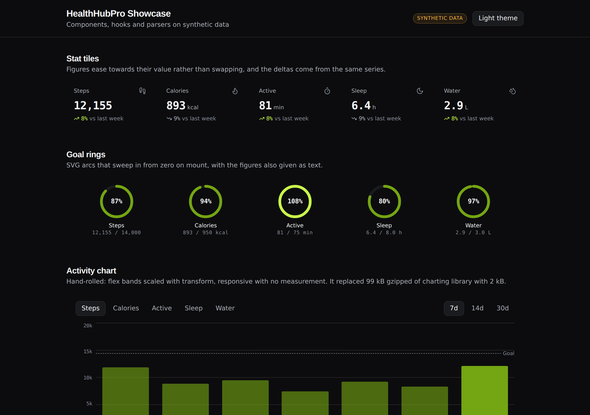
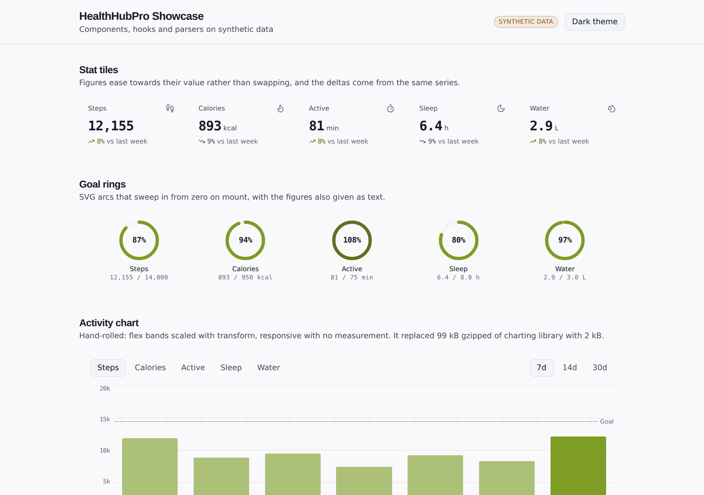
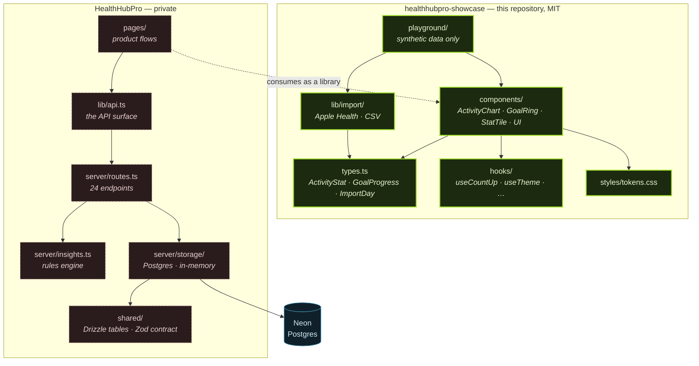
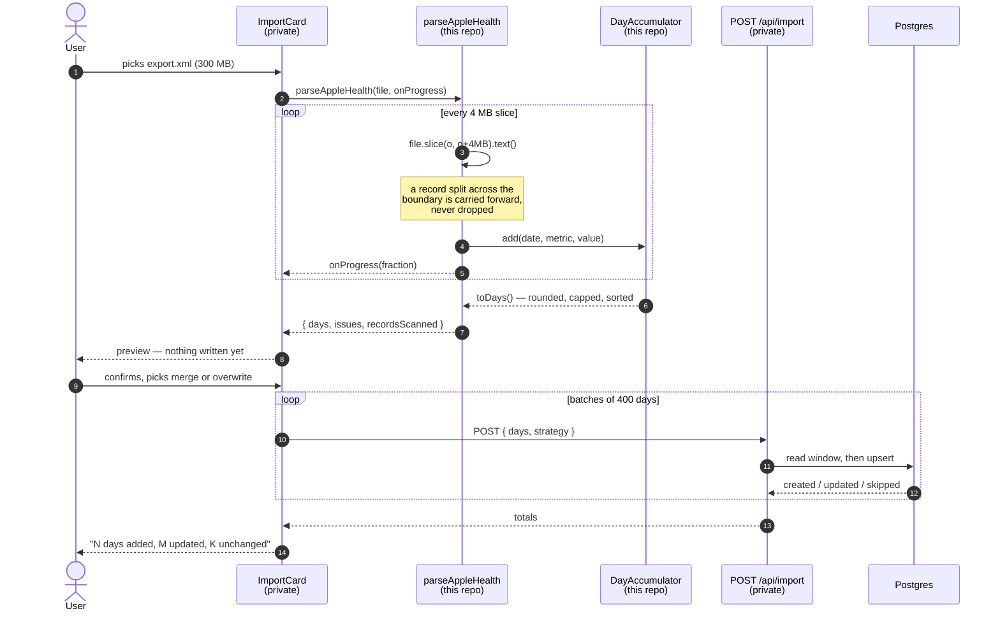

<div align="center">

<picture>
  <source media="(prefers-color-scheme: dark)" srcset="assets/hero-dark.svg">
  <source media="(prefers-color-scheme: light)" srcset="assets/hero-light.svg">
  
</picture>

<br>

[](https://github.com/DeAtHfIrE26/healthhubpro-showcase/actions/workflows/ci.yml)
[](LICENSE)
[](#engineering-highlights)
[](#engineering-highlights)
[](tsconfig.json)
[](https://react.dev)
[](https://vite.dev)
[](https://healthhubproapp.vercel.app)

**The parts of a health-tracking app that are worth reading on their own — a chart that replaced 99 kB of charting library with 2 kB, parsers that stream a 300 MB Apple Health export without loading it, and a design system that passes WCAG AA in both themes.**

[**Live Demo**](https://healthhubproapp.vercel.app) · [**Docs**](#table-of-contents) · [**Report Bug**](https://github.com/DeAtHfIrE26/healthhubpro-showcase/issues/new?template=bug_report.yml) · [**Request Feature**](https://github.com/DeAtHfIrE26/healthhubpro-showcase/issues/new?template=feature_request.yml)

</div>

---

## Table of contents

- [What this is](#what-this-is)
- [Demo](#demo)
- [Quick start](#quick-start)
- [Features](#features)
- [Tech stack](#tech-stack)
- [Project structure](#project-structure)
- [Architecture](#architecture)
- [Engineering highlights](#engineering-highlights)
- [Roadmap](#roadmap)
- [Contributing](#contributing)
- [License](#license)
- [Author](#author)

---

## What this is

[HealthHubPro](https://healthhubproapp.vercel.app) is a deployed health-tracking app — steps, sleep, hydration, workouts, challenges, and rule-based insights that always show their working. The application itself is private. **This repository is the part of it that stands on its own**: presentational components, hooks, formatting helpers and two file parsers, extracted, decoupled and independently tested.

There is no API client here, no database schema and no server code, so it cannot leak the product surface even by accident. What it can do is show how the interesting problems were solved. See [what is open and what is not](#whats-open-and-whats-not) for exactly where the line sits and why.

Everything in the playground runs on **synthetic data** generated in your browser from a seeded PRNG. No real person's health data appears in this repository.

<div align="right"><a href="#table-of-contents">back to top ↑</a></div>

---

## Demo

A 22-second walkthrough of the playground: metric tiles counting up, goal rings sweeping in, the chart switching metric and range, a tooltip, both parsers running on sample files, and the theme toggle.

<div align="center">
  
</div>

<table>
  <tr>
    <td width="50%" align="center"><strong>Dark</strong></td>
    <td width="50%" align="center"><strong>Light</strong></td>
  </tr>
  <tr>
    <td></td>
    <td></td>
  </tr>
</table>

> The accent is noticeably darker in light mode. That is deliberate and measured — see [the contrast case study](#engineering-highlights).

<div align="right"><a href="#table-of-contents">back to top ↑</a></div>

---

## Quick start

```bash
git clone https://github.com/DeAtHfIrE26/healthhubpro-showcase.git
cd healthhubpro-showcase
npm install
npm run dev
```

That is the whole setup. The playground opens at **http://localhost:5173** — no database, no API keys, no `.env`.

```bash
npm run verify           # lint, typecheck, test, build — what CI runs
npm test                 # 82 tests
npm run build            # library to dist/
npm run build:playground # playground as a static site
```

Requires Node 20.19+.

<details>
<summary><strong>Using the components in your own project</strong></summary>

<br>

```tsx
import { ActivityChart, GoalRing, StatTile, formatNumber } from 'healthhubpro-showcase';
import 'healthhubpro-showcase/tokens.css';

const history = [
  {
    date: '2026-09-20',
    steps: 8613,
    calories: 606,
    activeMinutes: 51,
    sleepHours: 8.5,
    waterLiters: 2.4,
  },
  // ...
];

<ActivityChart history={history} goals={goals} days={7} onDaysChange={setDays} />;
```

The components read plain objects — `ActivityStat`, `GoalProgress` — declared in [`src/types.ts`](src/types.ts). There is no client, no fetching and no global state, so wiring them to your own data is a matter of passing props.

Styling comes from CSS custom properties in [`src/styles/tokens.css`](src/styles/tokens.css). Override the tokens and everything follows; the components hard-code no colours.

</details>

<details>
<summary><strong>Parsing a health export</strong></summary>

<br>

```ts
import { detectFormat, parseAppleHealth, parseCsv } from 'healthhubpro-showcase';

const format = detectFormat(file); // 'apple-health' | 'csv' | 'unknown'
const { days, issues, recordsScanned } =
  format === 'apple-health'
    ? await parseAppleHealth(file, (p) => setProgress(p))
    : await parseCsv(file);
```

`days` is one entry per calendar day with only the metrics the file actually contained. `issues` lists every row that could not be read and why — nothing is dropped silently. `recordsScanned` is the honest denominator for a "read N records" summary.

The file is read in 4 MB slices, so peak memory tracks the chunk size rather than the file size.

</details>

<div align="right"><a href="#table-of-contents">back to top ↑</a></div>

---

## Features

|     |                         |                                                                                                                                                                                                                                                                       |
| --- | ----------------------- | --------------------------------------------------------------------------------------------------------------------------------------------------------------------------------------------------------------------------------------------------------------------- |
| 📊  | **`ActivityChart`**     | A bar chart in 5.7 kB. Flex bands scaled with `transform: scaleY()`, so it is responsive with no `ResizeObserver` and the scaling is GPU-composited. Metric and range switching, a dashed goal line, peak emphasis, a hover tooltip, and the same figures as a table. |
| 🎯  | **`GoalRing`**          | An SVG arc that sweeps in from zero on mount, with the numbers also given as text.                                                                                                                                                                                    |
| 📈  | **`StatTile`**          | A metric that eases towards its value instead of swapping, with a week-on-week delta.                                                                                                                                                                                 |
| 🍎  | **Apple Health parser** | Streams `export.xml` in 4 MB slices with a carry buffer. Maps steps, active energy (kJ → kcal), exercise time, water (mL/fl oz → L) and sleep. Ignores `InBed` records, which overstate real sleep.                                                                   |
| 📄  | **CSV parser**          | Column aliases for Google Fit, Fitbit and Garmin, three date layouts, quoted thousands separators, CRLF. Every failure names the columns it actually saw.                                                                                                             |
| 🎨  | **Design tokens**       | One accent, two themes, contrast computed rather than eyeballed. 100/100/100/100 on Lighthouse desktop.                                                                                                                                                               |
| ⚡  | **Hooks**               | `useCountUp` (rAF easing, honours reduced motion), `useTheme`, `useOnlineStatus`, `useIsMobile`, `useToasts`.                                                                                                                                                         |
| 🧩  | **UI primitives**       | 13 Radix-backed components — button, card, dialog, input, label, select, skeleton, toast, alert, avatar, badge, dropdown.                                                                                                                                             |
| ♿  | **Accessibility**       | Keyboard operable, visible focus, `aria-pressed` on toggles, charts described with `role="img"` and duplicated as tables. Nothing depends on colour alone.                                                                                                            |
| 🎬  | **Motion**              | Only `transform` and `opacity` animate. `prefers-reduced-motion` is honoured everywhere, including in the hero banner above.                                                                                                                                          |

<div align="right"><a href="#table-of-contents">back to top ↑</a></div>

---

## Tech stack

<div align="center">


</div>

TypeScript in `strict` mode with `noUncheckedIndexedAccess`. Zero charting dependencies — that is the point of the chart.

<div align="right"><a href="#table-of-contents">back to top ↑</a></div>

---

## Project structure

```
healthhubpro-showcase/
├── assets/                     hero SVGs, demo GIF, screenshots
├── playground/
│   ├── App.tsx                 every component, on synthetic data
│   ├── demo-data.ts            seeded PRNG — no real health data
│   └── public/
├── src/
│   ├── components/
│   │   ├── data/               ActivityChart · GoalRing · StatTile
│   │   ├── common/             ErrorBoundary · States
│   │   └── ui/                 13 Radix-backed primitives
│   ├── hooks/                  useCountUp · useTheme · useOnlineStatus · …
│   ├── lib/
│   │   ├── format.ts           dates, durations, numbers  (+ 32 tests)
│   │   ├── utils.ts            cn()
│   │   └── import/
│   │       ├── aggregate.ts    DayAccumulator · streamText
│   │       ├── appleHealth.ts  chunked XML scanner
│   │       └── csv.ts          alias-aware CSV reader     (+ 33 tests)
│   ├── styles/tokens.css       the design system
│   ├── types.ts                standalone types — no app import
│   └── index.ts                public surface
└── .github/workflows/ci.yml    lint · format · typecheck · test · build · secret scan
```

<div align="right"><a href="#table-of-contents">back to top ↑</a></div>

---

## Architecture

How the published library relates to the private application.



**The main data flow** — importing a year of history. The interesting property is that the file never leaves the browser; only the aggregated day totals are uploaded.



### What's open and what's not

|                    | Open here                             | Private                                                 | Why                                                                                                          |
| ------------------ | ------------------------------------- | ------------------------------------------------------- | ------------------------------------------------------------------------------------------------------------ |
| **Presentation**   | components, hooks, tokens, formatting | —                                                       | Generic. Nothing about them is specific to this product.                                                     |
| **Parsers**        | Apple Health, CSV                     | the Zod import contract                                 | The parsers are format adapters with no domain rules. The contract they feed describes the API, so it stays. |
| **Types**          | minimal shapes the components read    | Drizzle tables, Zod validators                          | The public types are what a prop needs. The private ones are the database and the API surface.               |
| **Product logic**  | —                                     | insights engine, merge strategy, leaderboard derivation | This is the actual product.                                                                                  |
| **Infrastructure** | —                                     | routes, auth, storage, deploy config                    | Publishing the endpoint map and the cookie scheme helps nobody but an attacker.                              |

The rule when it was ambiguous: **keep it private**. The parsers are the one call that went the other way, and [the audit explains that decision](#engineering-highlights) — they carry no health-domain logic, and the chunk-boundary technique is the part worth reading.

<div align="right"><a href="#table-of-contents">back to top ↑</a></div>

---

## Engineering highlights

Every number below was measured, and the command that produces it is given.

### Lighthouse

Run against the production playground build (`npm run build:playground`), Lighthouse 13.5:

|             | Performance | Accessibility | Best practices | SEO     | LCP   | TBT    | CLS |
| ----------- | ----------- | ------------- | -------------- | ------- | ----- | ------ | --- |
| **Desktop** | **100**     | **100**       | **100**        | **100** | 0.4 s | 0 ms   | 0   |
| **Mobile**  | **99**      | **100**       | **100**        | **100** | 1.4 s | 110 ms | 0   |

```bash
npm run build:playground && npx vite preview --config vite.playground.config.ts --port 4180
npx lighthouse http://localhost:4180/ --preset=desktop --view
```

### Tests

**82**, in four files, all runnable with `npm test`:

| Suite                                    | Count | What it protects                                                                                                                                                       |
| ---------------------------------------- | ----- | ---------------------------------------------------------------------------------------------------------------------------------------------------------------------- |
| `lib/format.test.ts`                     | 32    | Duration boundaries (59s/60s/3599s/3600s/86399s), local-vs-UTC date parsing, pluralisation, unicode initials                                                           |
| `lib/import/parsers.test.ts`             | 33    | Unit conversion, `InBed` exclusion, unreadable values reported not dropped, CSV aliases, three date layouts, CRLF — and **5,000 records straddling the 4 MB boundary** |
| `components/data/ActivityChart.test.tsx` | 12    | One bar per day with a real scale at 7/14/30 days, the accessible description, the table fallback, the empty state                                                     |
| `hooks/useCountUp.test.ts`               | 5     | Reduced motion lands on the target immediately; easing is monotonic and never overshoots                                                                               |

---

### 1. A chart that cost more than React

Recharts was **371 kB raw / 99 kB gzipped** — larger than React itself — for a bar chart of at most 30 bars with two axes, a dashed goal line and a hover tooltip. Profiling put ~270 ms of script self-time in its chunk, which was the last main-thread task over 100 ms on the dashboard.

|                        | Before                  | After                    |
| ---------------------- | ----------------------- | ------------------------ |
| Chart chunk            | 371.45 kB / 99.38 kB gz | **5.68 kB / 2.11 kB gz** |
| Dashboard payload      | 766 kB                  | **377 kB**               |
| Dashboard TBT (mobile) | 349 ms                  | **175 ms**               |

The feature did not change: same five metrics, same ranges, same peak emphasis, same goal line, same table view. It _gained_ a `role="img"` summary the SVG never had.

The technique is that bars are flex bands scaled with `transform: scaleY()` from the bottom. That makes the plot responsive with **no DOM measurement and no `ResizeObserver`**, and puts the resize on the compositor instead of in a layout pass.

<details>
<summary><strong>2. The bug that 90 tests missed</strong></summary>

<br>

The first version of that chart rendered **every bar at zero width at the 30-day range**, and the entire test suite passed over it.

A percentage flex `gap` resolves against the **container**, not the band. At 30 days, twenty-nine gaps of 11% totalled 319% — flex shrank every bar to nothing to make room. The plot still drew its gridlines, its axes and its goal line, so everything a test would reasonably assert was still true. It was found by taking a screenshot.

```ts
// Before: gap is 11% of the container, so it scales with bar count.
<div className="absolute inset-0 flex items-end gap-[11%]">

// After: each day gets an equal band and the bar is inset within its own,
// so the spacing is a constant fraction of the band at any count.
<div className="absolute inset-0 flex items-end">
  <div className="relative h-full flex-1">
    <span className="absolute inset-x-[11%] bottom-0 top-0 origin-bottom …" />
```

The lesson worth keeping is not about flexbox. It is that **a visual component can be structurally correct and visually broken at the same time**, and only one of those is cheap to assert. `ActivityChart.test.tsx` now checks that every bar has a real scale at every range — the thing that actually broke.

Two more followed from the same screenshot pass: X labels truncated to `"S"` at 30 days because each was confined to a ~9 px band, and the tooltip survived a range switch, showing a stale index against a different day's data.

</details>

<details>
<summary><strong>3. A design system that failed AA everywhere nobody looked</strong></summary>

<br>

axe had only ever been run against the dark default. Light mode was failing WCAG AA on **every page — 42 nodes**.

The accent was the culprit, and the same number twice: at 38% lightness it measured **3.13:1 both as text on white and underneath white ink**, because those are the same ratio. That failed the week-on-week deltas, the primary button label and the avatar initials at once. The warn badge was 2.97:1 on its own tint.

Recomputed with a contrast script rather than a colour picker:

| Token                  | Before       | After        | Measured                                   |
| ---------------------- | ------------ | ------------ | ------------------------------------------ |
| `--accent` (light)     | `76 62% 38%` | `76 62% 28%` | 5.31:1 on white, 4.82:1 on raised surfaces |
| `--accent-dim` (light) | `88%`        | `90%`        | 4.62:1 for accent text on it               |
| `--warn` (light)       | `33 88% 42%` | `33 88% 32%` | 4.75:1 on its tint                         |
| `--chart-1`            | unchanged    | unchanged    | bars are graphics, judged at 3:1           |

Building this showcase surfaced one more. The `danger` button variant was `bg-danger text-white`, which in **dark** mode is `353 76% 62%` against white — **3.56:1**. The application never renders that variant, so it had never been seen. It now uses a `--danger-ink` token: near-black on dark (5.25:1), white on light.

The real fix in both cases was the coverage, not the colour. axe now runs in **both themes**.

</details>

<details>
<summary><strong>4. Parsing 300 MB in a browser tab</strong></summary>

<br>

An Apple Health `export.xml` routinely runs to hundreds of megabytes. `DOMParser` needs the whole document resident, so the parser scans with a regex over 4 MB slices instead, carrying the unconsumed tail forward between them:

```ts
let carry = '';
while (offset < file.size) {
  const end = Math.min(offset + chunkSize, file.size);
  const text = await file.slice(offset, end).text();
  carry = onChunk(carry + text, end >= file.size); // returns the unconsumed tail
  offset = end;
  onProgress?.(offset / file.size);
  await new Promise((r) => setTimeout(r, 0)); // let the UI paint
}
```

Peak memory tracks the chunk size, not the file size. The obvious failure mode is a record split across a boundary, so the test suite pads 5,000 records so they straddle the 4 MB slices and asserts the totals still sum exactly:

```ts
it('reassembles records split across read chunks', async () => {
  const padding = `<!--${'x'.repeat(1024)}-->\n`;
  const body = Array.from({ length: 5000 }, () => `${padding}${record(…'10'…)}`).join('\n');
  const { days } = await parseAppleHealth(file(wrapHealth(body), 'export.xml'));
  expect(days[0]?.steps).toBe(50_000); // 5000 × 10, none lost at a boundary
});
```

The parser also declines to guess. `InBed` sleep records are ignored because they overstate real sleep; kilojoules are converted to kilocalories; unmapped record types count toward `recordsScanned` but produce no day; and anything unreadable lands in `issues` with a reason rather than being dropped.

</details>

<details>
<summary><strong>5. A cold-start race that 500s the first request after a deploy</strong></summary>

<br>

_Not in this repository — the storage layer is private — but it is the find worth reading._

The app creates its schema on boot with `CREATE TABLE IF NOT EXISTS`. **That is not atomic.** The existence check and the creation are separate steps, so two serverless instances cold-starting together — exactly what the first requests after a deploy do — both find the table missing and both create it. The loser 500s:

```
NeonDbError 23505: duplicate key value violates unique constraint
"pg_class_relname_nsp_index"
Key (relname, relnamespace)=(users_id_seq, 2200) already exists
```

Neon caught it on the table's _implicit sequence_ rather than the table, which is why the message names a catalogue index. Reproduced locally against Postgres 16 with twelve concurrent creates released from a shared barrier: it failed on **round 3 of 25**, there surfacing as `42P07 relation already exists` — the same race caught a moment later. After the fix: **25 rounds × 12 concurrent creates, zero failures.**

The fix was three things: probe with `to_regclass` and only run DDL when the schema is genuinely absent (which also removed nine HTTP round trips from every cold start); tolerate duplicate-object errors, but only when the constraint is a `pg_` catalogue one so a real unique violation on application data still surfaces; and make seeding claim-based, because two instances could also both read zero users and both seed.

</details>

<div align="right"><a href="#table-of-contents">back to top ↑</a></div>

---

## Roadmap

Five ideas are written up in [ROADMAP.md](ROADMAP.md), four of them marked **good first issue** with the files to touch and a definition of done:

1. Line and area marks for `ActivityChart` — _good first issue_
2. A Google Fit `.zip` adapter — _good first issue_
3. Timezone-aware day bucketing
4. A `useReducedMotion` hook — _good first issue_
5. Publish the playground — _good first issue_

<div align="right"><a href="#table-of-contents">back to top ↑</a></div>

---

## Contributing

Pull requests are welcome. [CONTRIBUTING.md](CONTRIBUTING.md) has the setup, but the short version is `npm install && npm run dev`, and `npm run verify` before you push.

Two things worth doing by hand, because neither is automated: look at your change **in both themes**, and **at 375px**. Both of the bugs in the highlights above hid from a suite that only ever checked one.

- [Report a bug](https://github.com/DeAtHfIrE26/healthhubpro-showcase/issues/new?template=bug_report.yml)
- [Request a feature](https://github.com/DeAtHfIrE26/healthhubpro-showcase/issues/new?template=feature_request.yml)
- [Security policy](SECURITY.md) — please report vulnerabilities privately
- [Code of Conduct](CODE_OF_CONDUCT.md)

<div align="right"><a href="#table-of-contents">back to top ↑</a></div>

---

## License

[MIT](LICENSE) © Kashyap Patel

<div align="right"><a href="#table-of-contents">back to top ↑</a></div>

---

## Author

**Kashyap Patel** — full-stack engineer working across .NET, React, Python and cloud, with a focus on fast, well-crafted systems.

[](https://kashyappatel.vercel.app)
[](https://github.com/DeAtHfIrE26)
[](https://linkedin.com/in/kashyap-patel2673)
[](mailto:kashyappatel2673@gmail.com)

<div align="right"><a href="#table-of-contents">back to top ↑</a></div>
