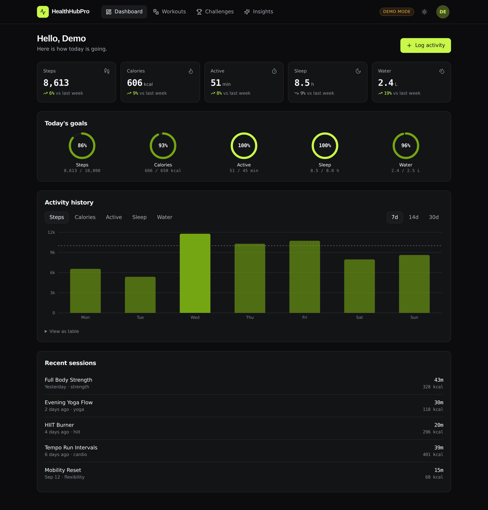
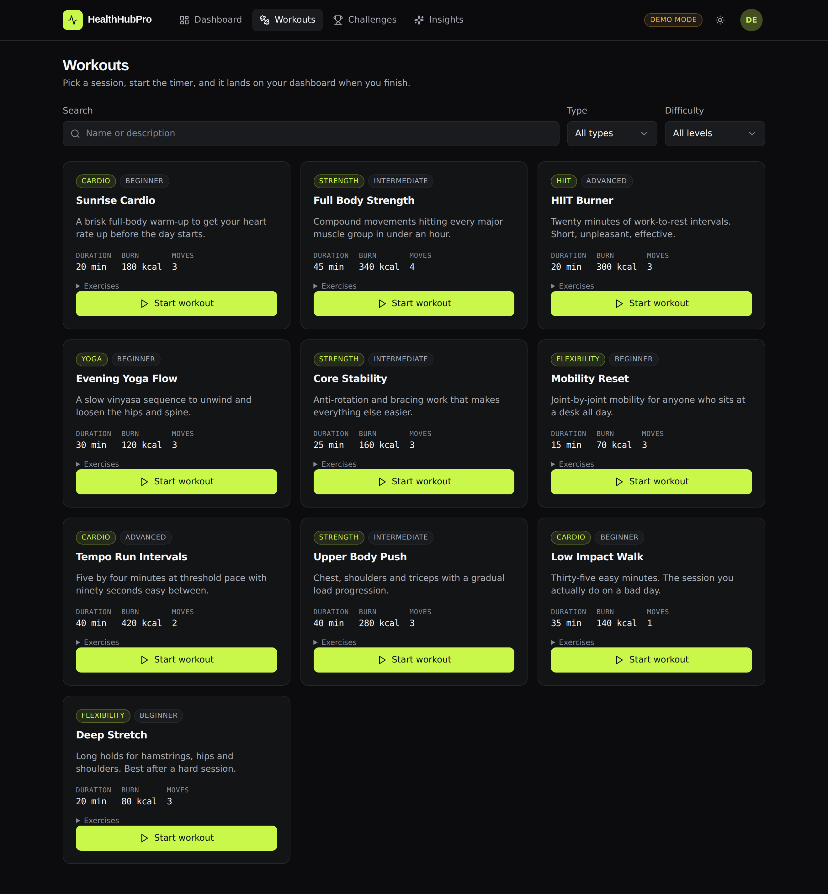
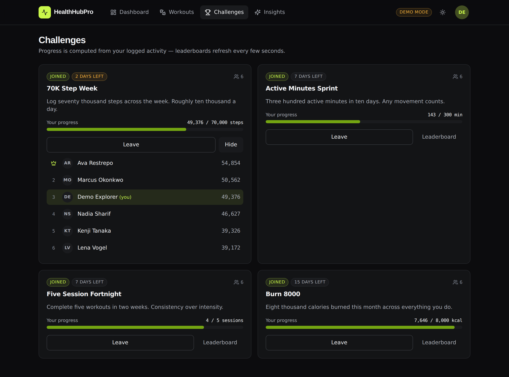
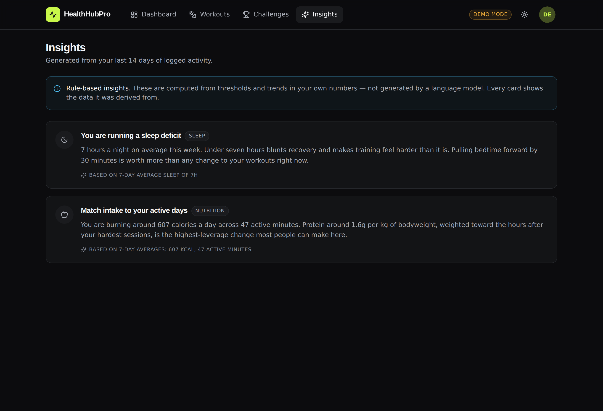
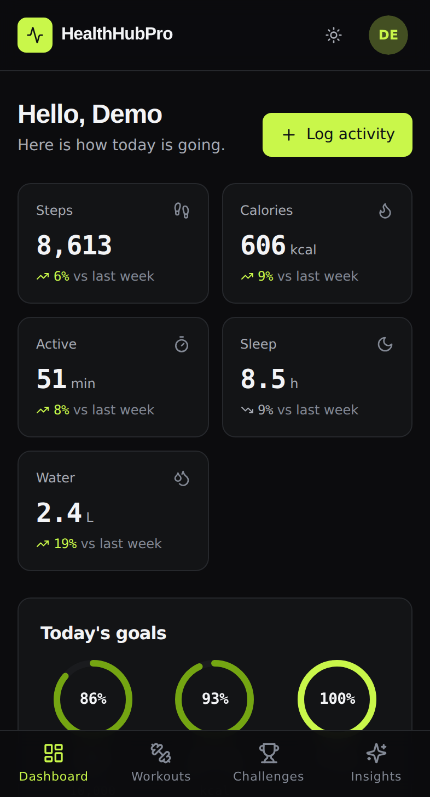

# HealthHubPro

**A health and fitness tracker that turns your own activity data into specific, explainable advice — no black box, no invented numbers.**

Log steps, sleep, hydration and workouts; compete on derived leaderboards; and get insights that always tell you which of your numbers produced them.



---

## Live demo

> **Deployment status:** the application is production-ready and its build is green, but the live URL needs two one-time actions on the Vercel account that could not be performed from the build environment. See [`docs/DEPLOYMENT.md`](docs/DEPLOYMENT.md) — it takes about two minutes.

**Demo credentials — `demo` / `demo1234`**

You never need them. The login screen has a **Try the demo** button that opens a fully populated account in one click: 30 days of activity, five goals, four running challenges with six competitors, and completed workout sessions. No sign-up, ever.

---

## What it does

|                |                                                                                                                                                                                                     |
| -------------- | --------------------------------------------------------------------------------------------------------------------------------------------------------------------------------------------------- |
| **Dashboard**  | Today's steps, calories, active minutes, sleep and water, each with a week-on-week delta. Five goal rings. A 7/14/30-day history chart across any metric, with your goal drawn as a reference line. |
| **Workouts**   | A catalogue filterable by type, difficulty and free text. Start a session, watch a live timer, finish it — calories are estimated from elapsed time against the workout's burn rate.                |
| **Challenges** | Join step, calorie, active-minute and workout-count challenges. Leaderboards rank every participant and refresh while you watch.                                                                    |
| **Insights**   | Rule-based recommendations derived from your last 14 days. Each card names the data behind it.                                                                                                      |

### About the "AI"

This project began as a coding-challenge submission that asked for OpenAI and TensorFlow. **It does not use either, and does not claim to.**

The recommendation engine is a deterministic rules engine over your own numbers: it compares this week's step average against last week's, measures the standard deviation of your sleep, counts goal-hit days, and checks training volume against recovery. Every insight carries a `basis` line stating exactly which figures produced it, and the UI says plainly that this is not a language model.

That is a deliberate trade-off. OpenAI has no free tier, so an LLM-backed version could not stay free to run — and a rules engine that explains itself is more useful to a user than an unexplainable sentence that costs money per request.

<details>
<summary><strong>More screenshots</strong></summary>

**Workouts** — filtering and an in-progress session


**Challenges** — derived progress and a live leaderboard


**Insights** — each card shows its basis


**Light theme**


**Mobile (360px)**



</details>

---

## Architecture

```
Browser
  │
  ├── /(.*)      ──▶  dist/            Vite SPA (React 18, wouter, TanStack Query)
  └── /api/(.*)  ──▶  api/index.ts     The whole Express app, as ONE function
                          │
                          ▼
                   Storage interface
                    ╱            ╲
       PostgresStorage          MemoryStorage
       (Drizzle + Neon)         (seeded, in-process)
       when DATABASE_URL set    otherwise
```

**One serverless function, not twenty.** Vercel's Hobby plan caps a deployment at 12 Serverless Functions and this API has about 20 routes, so splitting them per-file would fail the build outright. Vercel documents exporting an Express app as a function's default export, so the entire app mounts once.

**One storage interface, two implementations.** The route layer never knows which backend it is talking to. With `DATABASE_URL` set, data persists in Postgres; without it, the app seeds itself in memory and the header shows an honest `Demo mode` badge. Swapping between them requires no code change, and the integration suite runs against both.

**Progress is derived, never cached.** Challenge standings and goal completion are computed from activity rows on read. There is no counter to drift out of sync.

**No WebSockets.** Serverless functions cannot hold a socket open. The leaderboard polls every five seconds instead — visually identical, no second host to pay for.

---

## Tech stack

| Layer        | Choice                                  | Why                                                                              |
| ------------ | --------------------------------------- | -------------------------------------------------------------------------------- |
| Frontend     | React 18 + TypeScript, Vite 8           | Fast builds; strict typing across the client/server boundary via a shared schema |
| Routing      | wouter                                  | ~2 kB against React Router's ~20 kB for what is a five-route app                 |
| Server state | TanStack Query                          | Caching, retry policy and polling without hand-rolled effects                    |
| Styling      | Tailwind + Radix primitives             | Design tokens in CSS variables; Radix supplies the accessibility behaviour       |
| Charts       | Recharts                                | Lazy-loaded — it is a third of the bundle and the tiles above it matter more     |
| Backend      | Express 5-style on Express 4            | Mounts unchanged as a single Vercel function                                     |
| Validation   | Zod                                     | One schema module validates every API boundary and infers the client's types     |
| Database     | Drizzle + Neon serverless               | HTTP driver suits serverless; Neon's free tier needs no card                     |
| Auth         | bcrypt + signed httpOnly cookie         | No session store, so it survives cold starts on any instance                     |
| Tests        | Vitest, Supertest, Playwright, axe-core | Native ESM; E2E runs against the production build                                |

---

## Running it locally

**Requirements:** Node 22 (see `.nvmrc`). Nothing else — no database, no API keys.

```bash
git clone https://github.com/DeAtHfIrE26/HealthHubPro-Advanced-HealthMonitoring-App.git
cd HealthHubPro-Advanced-HealthMonitoring-App
npm install
npm run dev
```

Open **http://localhost:5173** and click **Try the demo**.

That is the whole setup. With no `DATABASE_URL`, the app seeds 30 days of activity into memory on boot and shows a `Demo mode` badge so you always know data will reset.

### Optional: persist data

```bash
cp .env.example .env
# Set DATABASE_URL to any Postgres connection string.
# A free Neon database (https://neon.com) needs no card.
```

The schema is created on first boot and seeded only if the `users` table is empty, so pointing at a fresh database Just Works.

### Scripts

| Command                | What it does                                 |
| ---------------------- | -------------------------------------------- |
| `npm run dev`          | API on :5000 and Vite on :5173, concurrently |
| `npm run build`        | Production client build into `dist/`         |
| `npm run lint`         | ESLint 9 flat config                         |
| `npm run format:check` | Prettier                                     |
| `npm run typecheck`    | `tsc` over client and server projects        |
| `npm test`             | Vitest — unit + integration                  |
| `npm run test:e2e`     | Playwright against the production build      |
| `npm run verify`       | lint → typecheck → test → build              |

---

## Testing

**166 unit and integration tests, 58 end-to-end tests** across a desktop and a mobile viewport. See [`docs/TESTING.md`](docs/TESTING.md) for coverage, what is not covered, and the bugs these suites caught.

```bash
npm test          # 166 passing, 7 Postgres tests skipped without DATABASE_URL
npm run test:e2e  # 58 passing across desktop + mobile
```

The integration suite exercises every route for happy path, bad input, unauthorised access, not-found and ownership — including forged and tampered session cookies, and identical responses for "unknown user" versus "wrong password" so usernames cannot be enumerated.

E2E runs against the **production build**, not the dev server, and every page is scanned with axe-core for serious and critical accessibility violations.

---

## Security

- Passwords hashed with **bcrypt** (cost 10).
- Sessions are **signed, httpOnly, SameSite=Lax** cookies. No server-side store, so any instance can verify any session.
- `SESSION_SECRET` is **required in production**. There is no fallback literal; a missing value produces a 503 naming the variable rather than a silent misconfiguration.
- Route guards reject unauthenticated requests, and session ownership is checked before a workout session can be modified.
- Profile updates use a **strict allow-list** — unknown keys are rejected, so no field can be set that the schema does not name.
- Mutations declaring a non-JSON `Content-Type` are refused: that is the only cross-site POST shape that does not require script.
- No secrets in the repository or its git history, verified across every commit.

Rate limiting is present but deliberately described as a brake rather than a quota: serverless instances do not share the counter, and Vercel's proxy can place many users behind one IP.

---

## Accessibility

Semantic landmarks, a skip link, `aria-current` navigation, labelled inputs with `aria-invalid` and `aria-describedby` on errors, live regions for async results, visible focus rings, and full keyboard operation. Both themes clear **WCAG AA (4.5:1)** on every surface — the tokens were computed against each background rather than eyeballed. The chart's data is also available as a table, so nothing is conveyed by colour alone. All motion respects `prefers-reduced-motion`.

---

## Deliberate omissions

- **Nutrition tracking** — cut. There was no data model, no API and no seed data behind it; it existed only as a nav link. An empty page would be worse than an honest absence.
- **Kubernetes, Nginx, Prometheus, Grafana** — the original repo carried manifests for infrastructure that never existed and has no free tier. Removed rather than kept as decoration.
- **Redis and InfluxDB** — both were `console.log` stubs. At this scale Postgres covers both jobs.
- **WebSockets** — incompatible with serverless; replaced with polling.

---

## Documentation

- [`docs/AUDIT.md`](docs/AUDIT.md) — the read-only audit of the original codebase that scoped this work
- [`docs/PLAN.md`](docs/PLAN.md) — the plan that came out of it
- [`docs/TESTING.md`](docs/TESTING.md) — test coverage and known gaps
- [`docs/DEPLOYMENT.md`](docs/DEPLOYMENT.md) — how to deploy, and the free-tier limits in play

## License

MIT — see [LICENSE](LICENSE).
